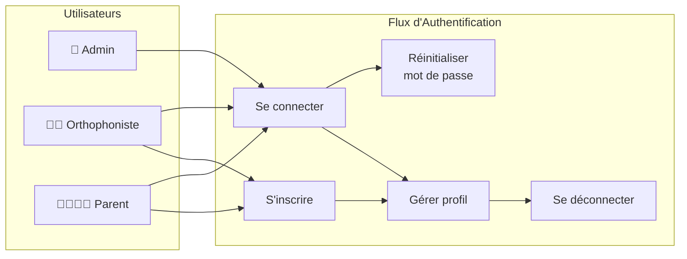
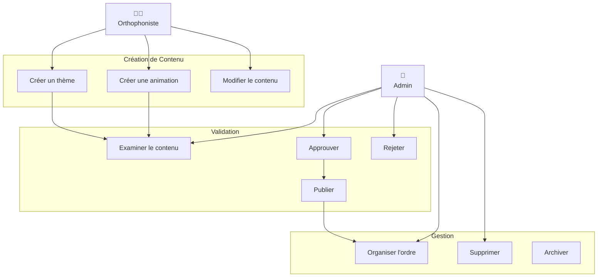
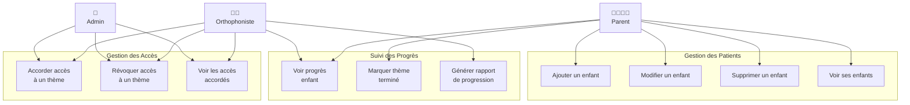
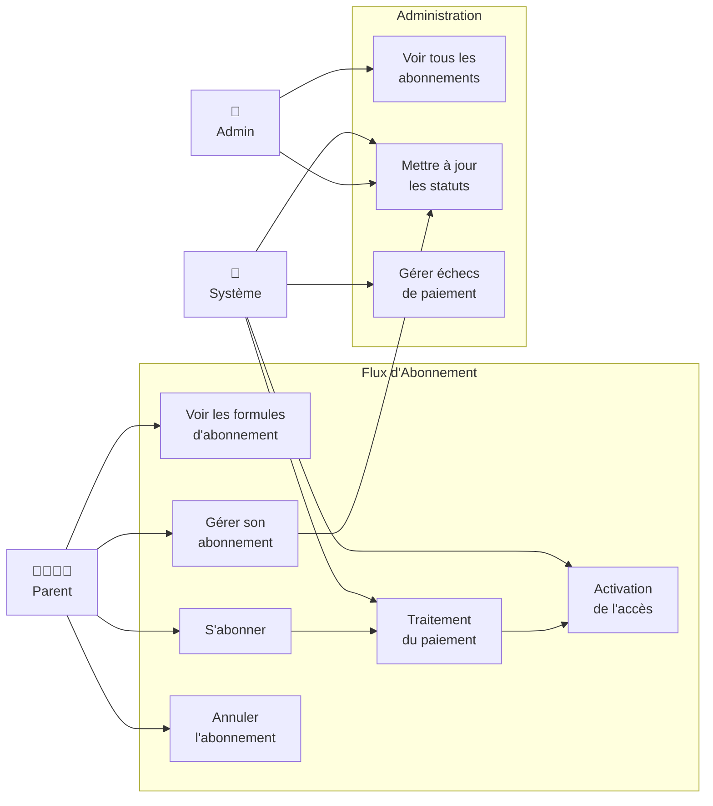

# 👥 Diagramme de Cas d'Utilisation - Cartissimo

## Vue d'ensemble
Ce diagramme présente l'ensemble des fonctionnalités du projet **Cartissimo** organisées de manière claire par acteur et domaine fonctionnel.

## Diagramme principal

```mermaid
flowchart TB
    %% Acteurs
    subgraph Acteurs [" "]
        Admin["👑<br/>Admin"]
        Ortho["👨‍⚕️<br/>Orthophoniste"]
        Parent["👨‍👩‍👧‍👦<br/>Parent"]
        System["🔧<br/>Système"]
    end

    %% Zone Admin - Supervision
    subgraph AdminZone ["🏛️ Zone Administration"]
        AdminAuth["Se connecter<br/>en tant qu'Admin"]
        ValidateContent["Valider les contenus<br/>(Thèmes/Animations)"]
        ManageUsers["Gérer les utilisateurs<br/>(Parents/Orthophonistes)"]
        SystemConfig["Configuration système<br/>(Ordre thèmes, paramètres)"]
        SuperviseSubscriptions["Superviser<br/>les abonnements"]
        GlobalAccess["Gérer accès thèmes<br/>pour tous patients"]
    end

    %% Zone Orthophoniste - Création
    subgraph OrthoZone ["🎨 Zone Professionnelle"]
        OrthoAuth["Se connecter<br/>Orthophoniste"]
        CreateContent["Créer du contenu<br/>(Thèmes/Animations)"]
        ManagePatients["Gérer ses patients<br/>(Suivi/Progrès)"]
        AssignContent["Attribuer thèmes<br/>à ses patients"]
        ViewProgress["Consulter progrès<br/>des enfants"]
    end

    %% Zone Parent - Utilisation
    subgraph ParentZone ["👨‍👩‍👧‍👦 Zone Familiale"]
        ParentAuth["Se connecter<br/>Parent"]
        FamilyManagement["Gérer sa famille<br/>(Ajouter/Modifier enfants)"]
        UseContent["Utiliser les thèmes<br/>avec ses enfants"]
        TrackProgress["Suivre les progrès<br/>de ses enfants"]
        ManageAccount["Gérer son compte<br/>et abonnement"]
    end

    %% Zone Système - Automatisation
    subgraph SystemZone ["⚙️ Zone Système"]
        ProcessPayments["Traiter les<br/>paiements Stripe"]
        UpdateSubscriptions["Mettre à jour<br/>statuts abonnement"]
        SendNotifications["Envoyer<br/>notifications"]
        BackupData["Sauvegarder<br/>les données"]
    end

    %% Relations Admin
    Admin --> AdminAuth
    Admin --> ValidateContent
    Admin --> ManageUsers
    Admin --> SystemConfig
    Admin --> SuperviseSubscriptions
    Admin --> GlobalAccess

    %% Relations Orthophoniste
    Ortho --> OrthoAuth
    Ortho --> CreateContent
    Ortho --> ManagePatients
    Ortho --> AssignContent
    Ortho --> ViewProgress

    %% Relations Parent
    Parent --> ParentAuth
    Parent --> FamilyManagement
    Parent --> UseContent
    Parent --> TrackProgress
    Parent --> ManageAccount

    %% Relations Système
    System --> ProcessPayments
    System --> UpdateSubscriptions
    System --> SendNotifications
    System --> BackupData

    %% Flux transversaux
    CreateContent -.-> ValidateContent
    ManageAccount -.-> ProcessPayments
    ProcessPayments -.-> UpdateSubscriptions
    TrackProgress -.-> ViewProgress

    %% Styles
    classDef adminClass fill:#ff6b6b,stroke:#c92a2a,stroke-width:2px,color:#fff
    classDef orthoClass fill:#51cf66,stroke:#37b24d,stroke-width:2px,color:#fff
    classDef parentClass fill:#74c0fc,stroke:#339af0,stroke-width:2px,color:#fff
    classDef systemClass fill:#ffd43b,stroke:#fab005,stroke-width:2px,color:#000

    class AdminAuth,ValidateContent,ManageUsers,SystemConfig,SuperviseSubscriptions,GlobalAccess adminClass
    class OrthoAuth,CreateContent,ManagePatients,AssignContent,ViewProgress orthoClass
    class ParentAuth,FamilyManagement,UseContent,TrackProgress,ManageAccount parentClass
    class ProcessPayments,UpdateSubscriptions,SendNotifications,BackupData systemClass
```

## Diagrammes détaillés par domaine

### 🔐 Authentification et Gestion des Comptes

### 🎨 Gestion du Contenu Éducatif

### 👶 Gestion des Patients et Accès

### 💳 Gestion des Abonnements

## Matrice des permissions

| Fonctionnalité | 👑 Admin | 👨‍⚕️ Orthophoniste | 👨‍👩‍👧‍👦 Parent | 🔧 Système |
|----------------|----------|----------------------|-------------------|-------------|
| **Authentification** | ✅ | ✅ | ✅ | ❌ |
| **Créer thèmes/animations** | ✅ | ✅ | ❌ | ❌ |
| **Valider contenus** | ✅ | ❌ | ❌ | ❌ |
| **Gérer tous les patients** | ✅ | ❌ | ❌ | ❌ |
| **Gérer ses patients** | ✅ | ✅ | ✅ | ❌ |
| **Accorder accès thèmes** | ✅ | ✅* | ❌ | ❌ |
| **S'abonner** | ❌ | ❌ | ✅ | ❌ |
| **Traiter paiements** | ❌ | ❌ | ❌ | ✅ |
| **Utiliser thèmes** | ✅ | ✅ | ✅ | ❌ |

*\* Orthophoniste : uniquement pour ses patients assignés*

## Flux principaux

### 🔄 Cycle de vie du contenu
1. **Création** : Orthophoniste crée thème/animation
2. **Validation** : Admin examine et approuve/rejette
3. **Publication** : Contenu rendu disponible
4. **Attribution** : Accès accordé aux patients
5. **Utilisation** : Parent/enfant utilise le contenu
6. **Suivi** : Progression trackée

### 🔄 Cycle d'abonnement
1. **Découverte** : Parent consulte les formules
2. **Souscription** : Choix et paiement
3. **Activation** : Système active l'accès
4. **Utilisation** : Accès aux thèmes premium
5. **Renouvellement** : Paiement automatique
6. **Gestion** : Modification/annulation

---
*Documentation technique - Projet Cartissimo* 