# 👥 Diagramme de Cas d'Utilisation - Cartissimo

## Vue d'ensemble
Ce diagramme présente l'ensemble des fonctionnalités du projet **Cartissimo** organisées par acteur et par module fonctionnel.

## Diagramme

```mermaid
graph TB
    %% Acteurs
    Admin[("👑 Admin")]
    Orthophoniste[("👨‍⚕️ Orthophoniste")]
    Parent[("👨‍👩‍👧‍👦 Parent")]
    System[("🔧 Système")]

    %% Cas d'utilisation - Authentification
    subgraph Auth["🔐 Authentification"]
        Login["Se connecter"]
        Register["S'inscrire"]
        Logout["Se déconnecter"]
        Profile["Gérer son profil"]
    end

    %% Cas d'utilisation - Gestion des thèmes
    subgraph ThemeManagement["🎨 Gestion des Thèmes"]
        CreateTheme["Créer un thème"]
        ApproveTheme["Approuver/Rejeter thème"]
        DeleteTheme["Supprimer un thème"]
        ViewThemes["Consulter les thèmes"]
        OrderThemes["Organiser l'ordre des thèmes"]
        GrantThemeAccess["Accorder accès aux thèmes"]
        RevokeThemeAccess["Révoquer accès aux thèmes"]
    end

    %% Cas d'utilisation - Gestion des patients
    subgraph PatientManagement["👶 Gestion des Patients"]
        AddChild["Ajouter un enfant"]
        EditChild["Modifier un enfant"]
        DeleteChild["Supprimer un enfant"]
        ViewChildren["Consulter ses enfants"]
        ManagePatients["Gérer tous les patients"]
        AssignTherapist["Assigner un thérapeute"]
        ViewPatientProgress["Voir progrès patient"]
    end

    %% Cas d'utilisation - Gestion des orthophonistes
    subgraph OrthoManagement["👨‍⚕️ Gestion Orthophonistes"]
        RegisterOrtho["Inscrire orthophoniste"]
        ManageOrtho["Gérer orthophonistes"]
        DeleteOrtho["Supprimer orthophoniste"]
        ViewOrthoList["Consulter liste orthophonistes"]
    end

    %% Cas d'utilisation - Gestion des animations
    subgraph AnimationManagement["🎬 Gestion des Animations"]
        CreateAnimation["Créer une animation"]
        ViewAnimations["Consulter les animations"]
        PlayAnimation["Jouer une animation"]
        CompleteTheme["Marquer thème comme terminé"]
    end

    %% Cas d'utilisation - Gestion des abonnements
    subgraph SubscriptionManagement["💳 Gestion Abonnements"]
        Subscribe["S'abonner"]
        ManageSubscription["Gérer abonnement"]
        ViewSubscriptionStatus["Voir statut abonnement"]
        ProcessPayment["Traiter le paiement"]
        UpdateSubscriptionStatus["Mettre à jour statut"]
    end

    %% Relations Admin
    Admin --> Login
    Admin --> ApproveTheme
    Admin --> DeleteTheme
    Admin --> OrderThemes
    Admin --> ManagePatients
    Admin --> ManageOrtho
    Admin --> RegisterOrtho
    Admin --> DeleteOrtho
    Admin --> GrantThemeAccess
    Admin --> RevokeThemeAccess
    Admin --> ViewSubscriptionStatus

    %% Relations Orthophoniste
    Orthophoniste --> Login
    Orthophoniste --> Register
    Orthophoniste --> Profile
    Orthophoniste --> CreateTheme
    Orthophoniste --> ViewThemes
    Orthophoniste --> CreateAnimation
    Orthophoniste --> ViewAnimations
    Orthophoniste --> AssignTherapist
    Orthophoniste --> ViewPatientProgress
    Orthophoniste --> GrantThemeAccess
    Orthophoniste --> RevokeThemeAccess

    %% Relations Parent
    Parent --> Login
    Parent --> Register
    Parent --> Profile
    Parent --> AddChild
    Parent --> EditChild
    Parent --> DeleteChild
    Parent --> ViewChildren
    Parent --> ViewThemes
    Parent --> ViewAnimations
    Parent --> PlayAnimation
    Parent --> CompleteTheme
    Parent --> Subscribe
    Parent --> ManageSubscription

    %% Relations Système
    System --> ProcessPayment
    System --> UpdateSubscriptionStatus

    %% Extensions et inclusions
    Subscribe -.-> ProcessPayment
    ProcessPayment -.-> UpdateSubscriptionStatus
    PlayAnimation -.-> CompleteTheme
```

## Description des acteurs

### 👑 Admin (Administrateur)
- **Rôle** : Supervision complète du système
- **Responsabilités** :
  - Validation des contenus (thèmes, animations)
  - Gestion des utilisateurs (parents, orthophonistes)
  - Configuration du système (ordre des thèmes)
  - Supervision des abonnements
  - Gestion des accès aux thèmes pour tous les patients

### 👨‍⚕️ Orthophoniste (Professionnel de santé)
- **Rôle** : Créateur de contenu et thérapeute
- **Responsabilités** :
  - Création de thèmes et animations éducatives
  - Suivi des patients qui lui sont assignés
  - Gestion des accès aux thèmes pour ses patients
  - Analyse des progrès des enfants

### 👨‍👩‍👧‍👦 Parent (Utilisateur final)
- **Rôle** : Utilisateur principal pour ses enfants
- **Responsabilités** :
  - Gestion du profil familial (enfants)
  - Utilisation des contenus éducatifs
  - Gestion de l'abonnement
  - Suivi des progrès de ses enfants

### 🔧 Système (Processus automatisés)
- **Rôle** : Automatisations et intégrations externes
- **Responsabilités** :
  - Traitement des paiements (Stripe)
  - Mise à jour automatique des statuts d'abonnement
  - Notifications et rappels

## Modules fonctionnels

### 🔐 Authentification
- **Inscription** : Création de compte pour tous les rôles
- **Connexion/Déconnexion** : Accès sécurisé par JWT
- **Gestion du profil** : Modification des informations personnelles

### 🎨 Gestion des Thèmes
- **Workflow de création** : Orthophoniste → Admin → Publication
- **Contrôle qualité** : Approbation/rejet par admin
- **Organisation** : Ordre d'affichage personnalisable
- **Gestion des accès** : Attribution sélective aux patients

### 👶 Gestion des Patients
- **Profil enfants** : Informations personnelles et éducatives
- **Relations thérapeutiques** : Assignation orthophoniste-patient
- **Suivi des progrès** : Complétion des thèmes
- **Gestion familiale** : Un parent, plusieurs enfants

### 👨‍⚕️ Gestion des Orthophonistes
- **Inscription professionnelle** : Validation par admin
- **Profil professionnel** : Coordonnées, spécialités
- **Intégration Doctolib** : Lien vers prise de rendez-vous

### 🎬 Gestion des Animations
- **Création multimédia** : GIF animés, sons, interactions
- **Validation qualité** : Contrôle avant publication
- **Expérience utilisateur** : Lecture fluide et intuitive

### 💳 Gestion des Abonnements
- **Souscription Stripe** : Paiement sécurisé
- **Statuts dynamiques** : Actif, expiré, en échec
- **Contrôle d'accès** : Limitation des fonctionnalités selon l'abonnement

## Relations et dépendances

### 🔄 Flux principaux
1. **Création de contenu** : Orthophoniste → Admin → Publication
2. **Utilisation** : Parent → Enfant → Thème → Animation
3. **Abonnement** : Parent → Paiement → Accès étendu
4. **Suivi** : Patient → Progression → Orthophoniste

### 🔐 Autorisations
- **Admin** : Accès total, supervision globale
- **Orthophoniste** : Création + patients assignés
- **Parent** : Famille + abonnement personnel

### 🎯 Objectifs métier
- **Qualité pédagogique** : Validation professionnelle des contenus
- **Personnalisation** : Accès sélectif selon les besoins
- **Rentabilité** : Modèle d'abonnement avec valeur ajoutée
- **Suivi thérapeutique** : Outils de progression pour les professionnels

---
*Généré pour le projet Cartissimo - Application d'orthophonie interactive* 