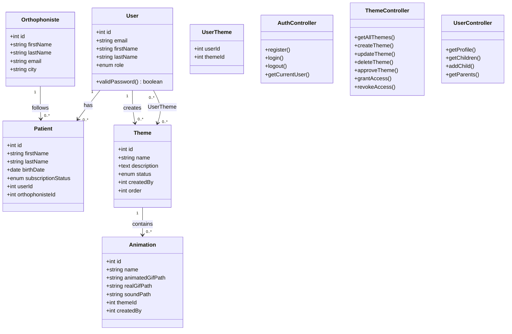

# 🏗️ Diagramme de Classes - Cartissimo

## Vue d'ensemble
Ce diagramme présente l'architecture orientée objet du backend du projet **Cartissimo**, incluant les modèles de données et les contrôleurs principaux.

## Diagramme

## Description des classes

### 📦 Modèles (Models)

#### 👤 User
- **Responsabilités** : Gestion des utilisateurs et authentification
- **Méthodes clés** : `validPassword()` pour la vérification des mots de passe
- **Rôles** : admin, orthophonist, parent

#### 👶 Patient
- **Responsabilités** : Représentation des enfants bénéficiaires
- **Caractéristiques** : Informations personnelles, statut d'abonnement
- **Relations** : Appartient à un User (parent), suivi par un Orthophoniste

#### 👨‍⚕️ Orthophoniste
- **Responsabilités** : Profil des professionnels de santé
- **Caractéristiques** : Informations professionnelles, coordonnées
- **Relations** : Peut suivre plusieurs patients

#### 🎨 Theme
- **Responsabilités** : Contenus éducatifs thématiques
- **Caractéristiques** : Workflow d'approbation, organisation par ordre
- **Relations** : Créé par un User, contient des Animations

#### 🎬 Animation
- **Responsabilités** : Éléments multimédias interactifs
- **Caractéristiques** : Fichiers GIF, sons, métadonnées
- **Relations** : Appartient à un Theme, créé par un User

#### 🔗 UserTheme
- **Responsabilités** : Table de liaison pour les accès aux thèmes
- **Caractéristiques** : Relation many-to-many User-Theme

### 🎛️ Contrôleurs (Controllers)

#### 🔐 AuthController
- **Responsabilités** : Gestion de l'authentification
- **Méthodes** :
  - `register()` : Inscription des utilisateurs
  - `login()` : Connexion avec JWT
  - `logout()` : Déconnexion
  - `getCurrentUser()` : Récupération du profil utilisateur

#### 🎨 ThemeController
- **Responsabilités** : Gestion complète des thèmes
- **Méthodes** :
  - `getAllThemes()` : Récupération selon le rôle
  - `createTheme()` : Création par orthophonistes
  - `updateTheme()` / `deleteTheme()` : Modification/suppression
  - `approveTheme()` : Validation par admin
  - `grantAccess()` / `revokeAccess()` : Gestion des accès

#### 👤 UserController
- **Responsabilités** : Gestion des utilisateurs et relations
- **Méthodes** :
  - `getProfile()` : Consultation du profil
  - `getChildren()` : Liste des enfants d'un parent
  - `addChild()` : Ajout d'un enfant
  - `getParents()` : Liste complète (admin uniquement)

## Patterns et principes

### 🏛️ Architecture MVC
- **Modèles** : Représentation des données et logique métier
- **Contrôleurs** : Traitement des requêtes HTTP et logique applicative
- **Vues** : Interface frontend (Vue.js - séparée)

### 🔐 Sécurité
- **Authentification JWT** : Tokens sécurisés
- **Hachage bcrypt** : Mots de passe chiffrés
- **Middleware d'autorisation** : Contrôle d'accès par rôle

### 📊 Base de données
- **ORM Sequelize** : Abstraction base de données
- **Relations déclaratives** : Associations automatiques
- **Migrations** : Évolution contrôlée du schéma

---
*Généré pour le projet Cartissimo - Application d'orthophonie interactive* 