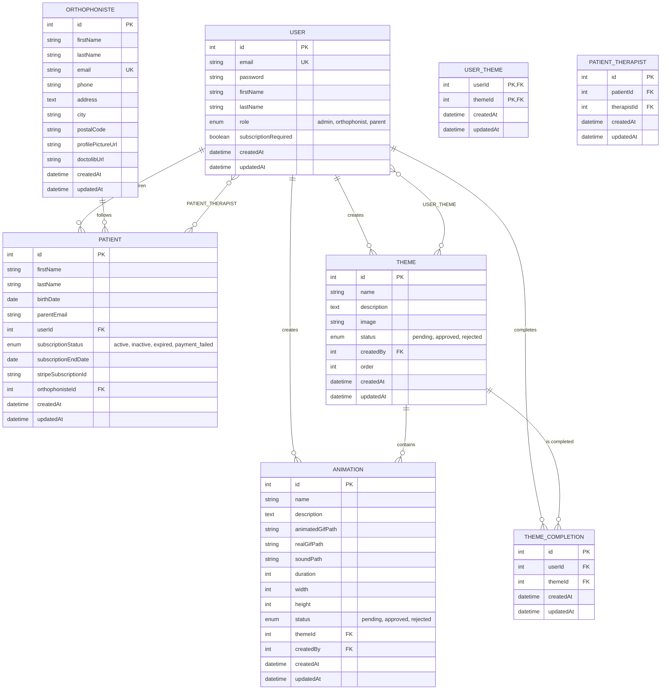

# 📊 MCD (Modèle Conceptuel de Données) - Cartissimo

## Vue d'ensemble
Ce diagramme présente la structure complète de la base de données du projet **Cartissimo**, une application d'orthophonie interactive pour enfants.

## Diagramme

## Description des entités

### 👤 USER
- **Rôle** : Utilisateurs principaux du système (admin, orthophoniste, parent)
- **Caractéristiques** : Authentification, profil, permissions selon le rôle

### 👶 PATIENT  
- **Rôle** : Enfants bénéficiaires des thérapies
- **Caractéristiques** : Informations personnelles, statut d'abonnement, liaison parent/thérapeute

### 👨‍⚕️ ORTHOPHONISTE
- **Rôle** : Professionnels de santé créateurs de contenu
- **Caractéristiques** : Profil professionnel, coordonnées, intégration Doctolib

### 🎨 THEME
- **Rôle** : Contenus éducatifs thématiques
- **Caractéristiques** : Workflow d'approbation, ordre d'affichage, créateur

### 🎬 ANIMATION
- **Rôle** : Éléments multimédias interactifs
- **Caractéristiques** : Fichiers GIF animés/réels, sons, dimensions, statut

### 🔗 Tables de liaison
- **USER_THEME** : Accès aux thèmes par utilisateur
- **PATIENT_THERAPIST** : Relations patient-thérapeute
- **THEME_COMPLETION** : Suivi de progression des thèmes

## Relations principales
- Un **parent** peut avoir plusieurs **enfants** (patients)
- Un **orthophoniste** peut suivre plusieurs **patients**
- Un **thème** peut contenir plusieurs **animations**
- Les **utilisateurs** peuvent avoir accès à plusieurs **thèmes** (many-to-many)
- Les **patients** peuvent être suivis par plusieurs **thérapeutes** (many-to-many)

---
*Généré pour le projet Cartissimo - Application d'orthophonie interactive* 